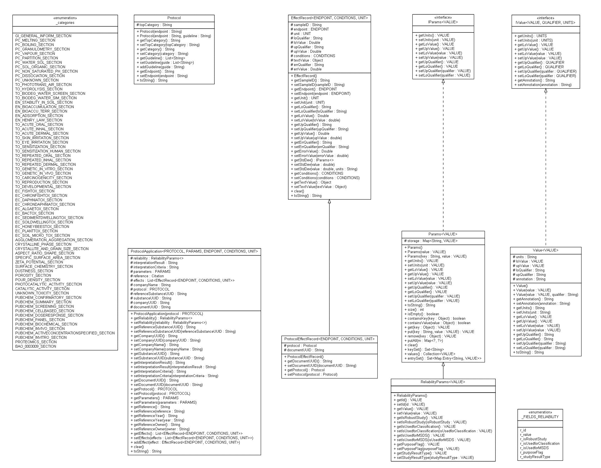

nmdataparser
============

Configurable parsers for different eNanoMapper input data formats

#### Options

1. *DATA_ACCESS*	This section defines the basic parameters for data access and iteration of the primary sheet
2. ITERATION	Defines the iteration mode. Possible iteration modes are:
ROW_SINGLE, ROW_MULTI_FIXED, ROW_MULTI_DYNAMIC, ABSOLUTE_LOCATION, JSON_VALUE, JSON_REPOSITORY, VARIABLE
3. SHEET_INDEX	The primary sheet for iteration
4. SHEET_NAME	The primary sheet name
5. START_ROW	The starting row for iteration
6. START_HEADER_ROW	The first (starting) header row
7. END_HEADER_ROW	The last (ending) header row
8. ALLOW_EMPTY	Flag that defines whether empty cells are allowed. Default value is true 
9. RECOGNITION	The mode for sheet/column/row recognition. These elements can be recognized by index or by name.
10. DYNAMIC_ITERATION	Defines how dynamic iteration is performed in mode ROW_MULTI_DYNAMIC. Several rows are read at once where the criterion for row group recognition is: NEXT_NOT_EMPTY or NEXT_DIFFERENT_VALUE.
11. DYNAMIC_ITERATION_COLUMN_INDEX	The column used for the dynamic iteration.
VARIABLES	Defines an array of excel locations that are read into work variables stored for later used if the reading process
12. PARALLEL_SHEETS [ ]	This is an array of sections similar to section DATA_ACCESS that define the simultaneous reading of several sheets together with the primary sheet. 
13. SUBSTANCE_RECORD	Section that defines the excel locations for reading of the basic fields of a Substance Record: COMPANY_NAME, OWNER_NAME, SUBSTANCE_TYPE, OWNER_UUID, COMPANY_UUID, PUBLIC_NAME, ID_SUBSTANCE, COMPOSITION
14. PROTOCOL_APPLICATIONS [ ]	This is an array of sections , defining the excel data locations for reading of Protocol Application data. Each section includes following fields:  CITATION_TITLE, CITATION_YEAR, CITATION_OWNER,  INTERPRETATION_RESULT, INTERPRETATION_CRITERIA, PROTOCOL_GUIDELINE, PARAMETERS (an array of data locations), EFFECTS (an array of sections)
15. EFFECTS [ ]	This is an array of sections. Each section defines data structures (effect record) for particular measurements and includes following excel data locations: SAMPLE_ID, ENDPOINT, LO_VALUE, UP_VALUE, ERR_VALUE, TEXT_VALUE, VALUE, LO_QUALIFIER, UP_QUALIFIER, ERR_QUALIFIER, UNIT, CONDITIONS (an array of data locations)
16. REPOSITORY	A JSON structure for defining preconfigured data (e.g. protocol, parameters) to be read directly from the JSON file into the data classes. 

##### Example:
- [JSON configuration](https://github.com/enanomapper/nmdataparser/blob/master/src/test/resources/net/enanomapper/parser/csv/ProteinCoronaTest1.json)
- [Excel file](https://github.com/enanomapper/nmdataparser/blob/master/src/test/resources/net/enanomapper/parser/csv/ProteinCoronaTest1.xlsx)

--

####Data model JAVADOC 

#####Java classes for describing Substances

* [Substance](http://ambit.uni-plovdiv.bg/downloads/ambit2/2.7.0-SNAPSHOT/apidocs/ambit2/base/data/SubstanceRecord.html)

* [Substance composition](http://ambit.uni-plovdiv.bg/downloads/ambit2/2.7.0-SNAPSHOT/apidocs/ambit2/base/relation/composition/CompositionRelation.html)

#####[Java classes](http://ambit.uni-plovdiv.bg/downloads/ambit2/2.7.0-SNAPSHOT/apidocs/ambit2/base/data/study/package-summary.html) for describing measurements

* [Protocol](http://ambit.uni-plovdiv.bg/downloads/ambit2/2.7.0-SNAPSHOT/apidocs/ambit2/base/data/study/Protocol.html)

* [Protocol parameters or conditions](http://ambit.uni-plovdiv.bg/downloads/ambit2/2.7.0-SNAPSHOT/apidocs/index.html?ambit2/base/data/study/Params.html) 

* [Protocol application](http://ambit.uni-plovdiv.bg/downloads/ambit2/2.7.0-SNAPSHOT/apidocs/ambit2/base/data/study/ProtocolApplication.html)

* [EffectRecord](http://ambit.uni-plovdiv.bg/downloads/ambit2/2.7.0-SNAPSHOT/apidocs/ambit2/base/data/study/EffectRecord.html)

* [Value](http://ambit.uni-plovdiv.bg/downloads/ambit2/2.7.0-SNAPSHOT/apidocs/ambit2/base/data/study/Value.html)

* 

--

 The parser will enable import into http://data.enanomapper.net 
 
